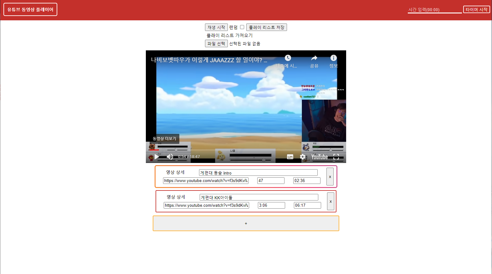
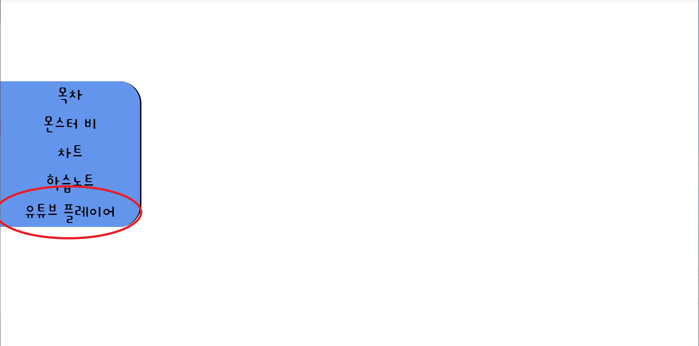

# 유튜브 커스텀 플레이어

## 목차

## 개요

    이 파일은 유튜브 플레이어 입니다.

 

## 기능

1. 유튜브 링크 복붙을 통해서 손쉽게 리스트 생성.
2. 영상 리스트에서 원하는 구간만 들을 수 있도록 손쉬운 편집이 가능 (예를 들면 7초 부터 3:30 까지만 재생)
3. 버프 갱신용 알람기능 (알람 발생 시 팝업창이 뜨며, 알람음과 팝업창 뜸. 단 팝업 허용해야됨)
4. 랜덤재생, 순차적 재생 가능
5. 한곡만 무한반복 가능
6. 플래이 리스트 데이터 저장 및 불러오기 가능

## 설치

##### case1 직접 설치

    1. 파일을 다운로드 받습니다.
    2. 압축을 풉니다.
    3. app.html을 따블클릭합니다.

##### case2 웹사이트

    1. http://gchickens.com 에 접속합니다.

    2. 유튜브 플레이어를 클릭합니다.

## 활용

#### 기본 버튼 및 입력

    [재생 시작] : 영상 하단의 플레이 리스트를 재생합니다. 빈 링크가 있으면 
    [랜덤] : 채크 시 현재 플레이 리스트의 다음곡이 무작위로 선택됩니다.
    [플레이 리스트 저장] : 현재 플레이 리스트가 텍스트 파일로 Download 파일에 저장됩니다.
    [파일 선택] : 플레이 리스트 저장을 통해 추출했었던 플레이 리스트를 불러옵니다.
    [영상 상세] : 이 링크의 영상에 대하여 설명을 적습니다. 비워둬도 정상작동합니다.
    [유튜브 링크] : 링크를 붙여 넣거나 영상코드를 입력합니다.
    [시작 시간] : 영상의 시작시간을 입력합니다. 미입력 시 처음부터 시작합니다. ex) 100 또는 1:40 또는 0:1:40
    [종료 시간] : 다음 영상으로 넘어갈 시간을 입력합니다. 미입력 시 끝까지 재생합니다. ex) 100 또는 1:40 또는 0:1:40
    [타이머] : 타이머 시작 버튼을 누르면 입력한 시간에서 1초씩 줄어듭니다. 일시 중지 할 수 있으며, 시간이 모두 소모되면 영상이 일시정지되고 팝업창이 뜹니다. 팝업창을 종료하면 다시 영상이 재생됩니다.

